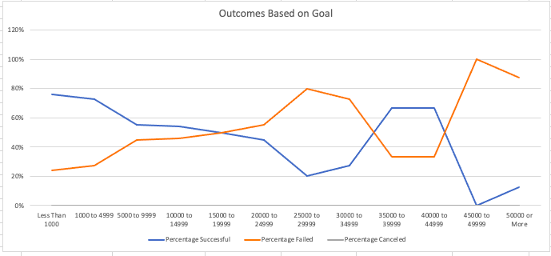

# Kickstarting with Excel

## Overview of Project
Use Excel to perform various skills aquired in Module 1 exercises and apply to a real-world problem to solve and report results. Louise has gathered much data for past Kickstarter campaigns and has asked me to derive information based on this sample size. They had origianlly worked with me for help in understanding if the goal for over $10,000 was reasonable for success so she could get funding to put on a play titles "Fever". In the end, they reached their goal before the campaign's end date. Now she would like me to see how other plays with similar goals measured in comparrison to theirs.

### Purpose
To assist Louise in understanding how launch date and/or funding goals could possibly contribute to successful campaigns using pivot tables, percentage tables, and vizualizations to help analyze Louise success to others with similar goals.

## Analysis and Challenges

### Analysis of Outcomes Based on Launch Date
)
Assuming Louise launched their campaign in May and looking at our sample size of theater campaigns we can observe the following:
- 166 theater campaigns launched in May in outher years: 111 successful, 52 failed, and 3 canceled. 
- May was also the month with the largest amount of theater campaigns launched in a month with June closely behind. 
- The success percentage of theater campaigns for the month of May was the highest at 67%. 
- December had the lowest success rate at 49%.

### Analysis of Outcomes Based on Goals

Assuming Lousie's goal was between $10,000 and $14,999, as well as, looking at our sample size of play campaigns we can observe the following:
- Play campaigns with a goal between $10,000 and $14,999 were 95% successful, 5% failed, and 0% cancelled.
- Play campaigns with higher goals had 100% success: $15,000 to $19,999 ; $25,000 to $29,999.
- Play campaigns asking for more than $45,000 had very low to no success.
- No Play campaigns were canceled

### Challenges and Difficulties Encountered
The only challenge I faced on this data report was remembering that the plays were to be taken into account when creating the formula for outcomes based on Goals 

## Results
- What are two conclusions you can draw about the Outcomes based on Launch Date?
1. The months May and June are the best months to launch a theater campaign. 
2. December has the lowest success rate of 49%.
- What can you conclude about the Outcomes based on Goals?
1. 
- What are some limitations of this dataset?

- What are some other possible tables and/or graphs that we could create?
1. 